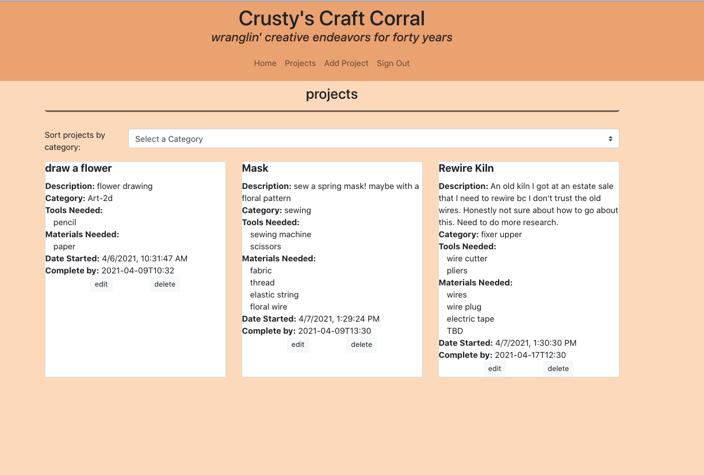
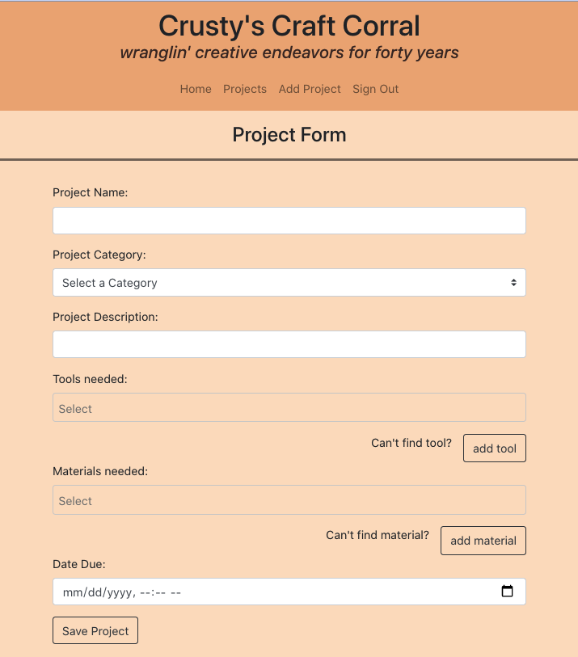
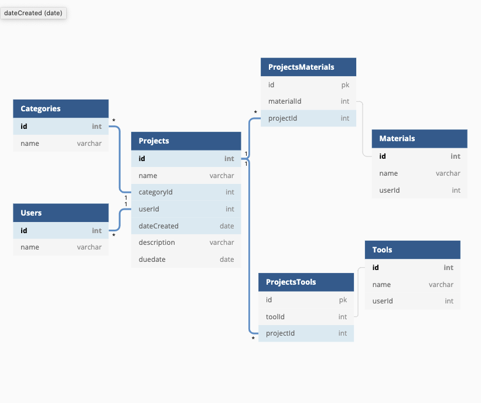
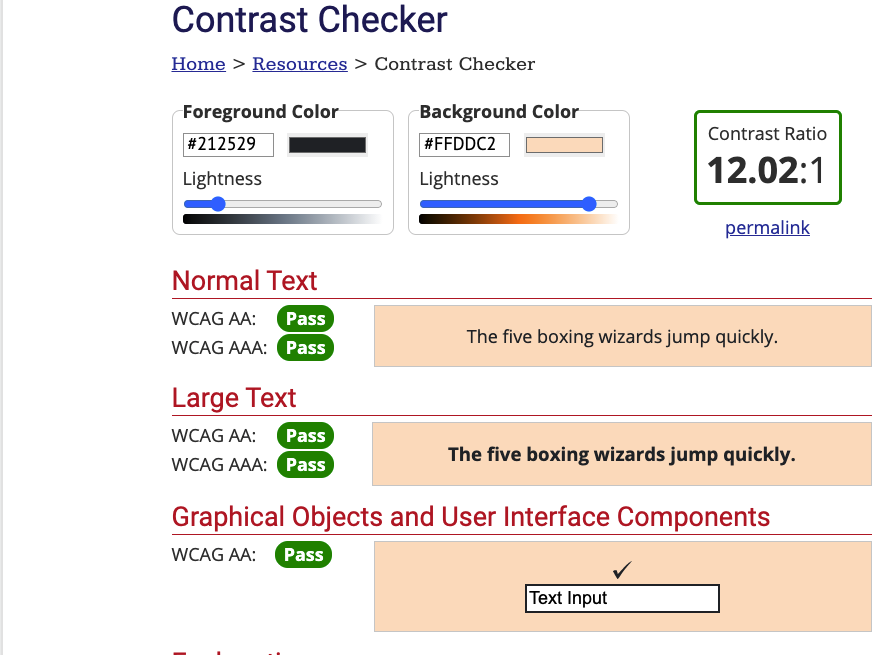

# Craft-Corral

 Craft Corral is an app meant to help users add, delete, edit, and keep their projects organized. I built this because I have a bad habbit of starting multiple different projects at once and then usually forgetting about half of them.  I hope having a place where I can view and remove all of my projects I'm currently working on will allow me to keep track of them and have a better completion rate. 

# Tech used
-HTML, CSS, React JS, Bootstrap
-crusty was made with thispersondoesnotexist.com and then edited with pixlr(E)

# Screenshots 

# ERD

# Accessibility 

